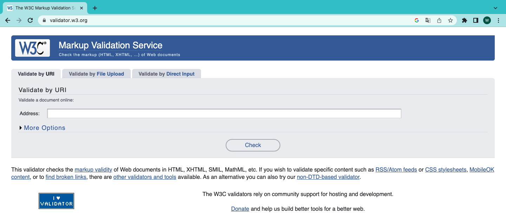

# Teorihandboken - HTML & CSS (HC)

Inlämningsdatum: 20231119

Studerande: 

### William Berhane 

### FWD-23 - Chas Academy

 

## Begrepp ord:

### CSS(stilmall)

står för ***Cascading Style Sheet*** och ett programmering språk som stylar hur en hemsida ska se ut.

### Design

är ett metod där man i detalj fastställer hur ett system ska se ut innan man börjar realisera det.

### HTML

står för ***Hypertext Markup Language*** och ett språk man använder för att skriva och strukturera text, bilder och länkar på en hemsida. 

### Optimering

är fastställande av det värde som ger det bästa utfallet för ett visst ändamål, till skillnad från det högsta värdet(maximering) eller det lägsta värdet (minimering).

### Responsiv

betyder att den anpassar sig med olika skärmstorlekar med hjälp av en flytande layout. 

### Tillgänglighet 

är det att en resurs i ett IT-system är möjligt att nå och att kommunicera med.

### Validering

kontroll av att något verkligenhar de egenskaper som det uppges eller förväntas ha. 

### Webb

är där innehållet på hemsidorna till stor del skapas av användarna och är tillgängligt för alla.

## HC 1.1 HTML & CSS

**HTML** står för "Hyper Text Markup Language" eller (extern stilmallar lagras i (.html)) och är det språk som alla webbsidor är byggda av. Det berättar hur en hemsida ska se ut och är alltså ett så kallat sidbeskrivningsspråk. Med hjälp av så kallade HTML-taggar kan du till exempel placera in bilder eller tabeller.

 

HTML har taggar,elements, attributes och där kan man skapa hemsida och redigera hemsida via olika sorts av TextEditor, Notepad, Notepad++ och andra framwork appar på windows, Mac och Linux.

Ett vanligt structurade HTML hemsida ser ut som: 

 

Alla HTML- element har attribut:
   - href - attributet för `<a>` anger webbadressen till sidan som en länk går till. 
   - src - attributet för `` anger sökvägen till bilden som ska visas. 
   - Bredd - och höjdattributen för `` ger storleksinformation för bilder. 
   - Alt - attributet för `` tillhandahåller en alternativ text för en bild. 
   - Style - attributet används för att lägga till stilar till ett element, som färg, teckensnitt, storlek med mera.
   - Lang - attributet för `<html>` - taggen deklarerar webbsidans språk. 
   - title - attributet definierar lite extra information om ett element. 

 

**CSS** står för "Cascading Style Sheets" (eller extern stilmallar lagras i .css) och används att beskriva hur HTML-element ska visas på skärmen, paper eller i andra media. Det viktigaste fördelen av CSS är att det sparar mycket arbete att styra layouten på fler webbsidor och app:ar. 

Ett vanligt css- strucuturad ser ut:

CSS har många Selectors och de mest grundläggande CSS-Selectors kan dela i fem kategorier:
   -  Simple selectors: (välj element baserat på `namn`, `id`, `klass`).
   -  Combinator selectors: (välj element baserat på ett specifikt förhållande mellan dem).
   - Pseudo-class selectors (välj element baserat på ett visst tillstånd).
   - Pseudo-elements selectors (välj och stil en del av ett element).
   - Attribute selectors (välj element baserat på ett attribut eller attributvärde).
  
   

En basic CSS-selectors exemplar:

## HC 1.2 Responsiv design
Responsiv design har ett unikt sätt att automatiskt anpassa designen på webbplatsen beroende på vilken enhet den visas på, och även om det tar lite arbete innan allt är konfigurerat och webbplatsen är helt anpassad, gör de enorma fördelarna det verkligen värt ansträngningen. Denna unika teknik gör att du sparar mycket tid och huvudvärk, och samtidigt kan du vara säker på att din sida kommer att se ut och fungera precis som du vill ha den, oavsett vilken enhet besökaren använder.

Fördelar med responsiv-design:

- Snygg design för alla enheter och plattformar 
- Bättre för sökmotoroptimering 
- Billigare att utveckla en responsiv webbplats istället för flera för olika enheter 
- Användarupplevelsen förbättras 
- Förenklar administration och överblick 

Nackdelar är naturligtvis inte de enda fördelarna med att använda responsiv design:

-  Vissa delar av layouter kan vara svåra att göra responsiva. Avancerade tabeller är ett exempel. 
-  Ibland måste man kompromissa med estetiken. Funktion måste komma före estetik för att ytan ska vara lyhörd för att vara praktisk. 
-  Responsiva webbplatser kan ibland vara svårare att arbeta med i vissa publiceringsverktyg (CMS) eftersom det finns fler sidmallar att ta hänsyn till.
-  Om du jobbar mot målgrupper med väldigt gamla sajter kan de ha problem med responsiva sidor eftersom sajten kräver några nya kommandon för att hanteras.

## HC 1.3 Tillgänglighet inom webb

Webbtillgänglighet beskriver hur man gör webbinnehåll mer tillgängligt för personer med funktionsnedsättning. Tillgänglighet omfattar ett brett spektrum av funktionshinder, inklusive syn-, hörsel-, fysiska, tal-, intellektuella, språk-, inlärnings- och neurologiska funktionshinder. Även om dessa riktlinjer täcker ett brett spektrum av frågor, kan de inte tillgodose behoven hos människor med alla typer, grader och kombinationer av funktionshinder. Dessa riktlinjer gör webbplatsinnehåll mer användbart för äldre individer vars förmågor förändras på grund av åldrande och ofta förbättrar användarna överlag.

WCAG(Web Content Accessibility Guidelines) tas vissa standard fram W3C Web Accessibility Initiative:
  
- Märkbar - gör det enkelt för användare att se och höra innehåll etc.
- Manövrerbar - hjälp användare navigera och hitta innehåll etc. 
- Begriplig - hjälp användare att undvika och rätta till misstag etc.
- Robust - maximera kompabilitet med nuvarande och framtida användarverktyg.

## HC 1.4 Aktuella webbstandarder (gällande och kommande standarder)

Webbstandarder är rekommendationer från World Wide Web Consortium (W3C) och andra standardiseringsorgan, om hur webbaserat innehåll ska skapas och tolkas. Webbplatsstandarder har funnits sedan webbutvecklings gryning, och det är först på senare år som rekommendationerna har fått ett brett stöd över stora sajter.

Det finns att en hemsida följer för webbstandarder:

- Följer W3C:s rekommendationer 
- Använder giltig HTML eller XHTML 
- Använder CSS i stället för tabeller för layout 
- Har logiskt uppmärkt innehåll 
- är skapat för att fungera i alla webbläsare  

Webbstandarder syftar till att säkerställa hållbarheten hos information som publiceras på webben, vilket gör den tillgänglig för så många webbanvändare som möjligt. Webbplatser som utformats för att följa webbläsarstandarder kommer att fortsätta att fungera korrekt även på nya webbläsare.

## HC 1.5 CSS Pre-processorer (ex SASS/LESS)

Det finns tre primära CSS-Preprocessorer på marknaden idag, `Sass` , `Less`  och `Stylus`. I det här inlägget kommer vi att jämför de två preprocessorerna som verkar vara de mest använda bland utvecklare, Sass vs Less. Genom att byta en pre-processorn kan hjälpa till att effektivisera din utvecklingsprocess.
En CSS pre-processorn är i grunden ett skriptspråk som utökar CSS och sedan kompilerar det till vanlig CSS. 

En vanlig Sass kod:

#### Sass Vs Less

Sass och Less är båda mycket kraftfulla CSS-tillägg. Du kan tänka på dem som mer av ett programmeringsspråk som är utformat för att göra CSS mer underhållbar, teman och utbyggbar. Både Sass och Less är bakåtkompatibla så att du enkelt kan konvertera dina befintliga CSS-filer bara genom att byta namn på `.css` filtillägget till `.less` eller `.scss` respektive. Less är JavaScript baserat och Sass är Ruby baserat.  

## HC 1.6 Optimering och validering av HTML & CSS

Optimering, sökmotoroptimering eller positionering betyder att utveckla webbsidor så att de blir sökbara och att de verkligen hitta via sökmotorer på Internet. Webbsökaren letar efter en produkter eller en service på de förtsa  fem sidorna som en sökmotor visar oss optimering hjälper att placera dina sidor på de första fem sidorna på sökmotorerna. Optimering är den enda tekniken för webbsidor för att hitta nya besökare och klienter.

#### Hur optimerar man en webbsida för sökmotorerna

För att optimera webbsidor, så att de blir sökbara och för att webbesökaren ska hitta dem via sökmororer, behövs en webbteknik som anpassar sidorna till en algoritm med över 100 parameter. Detta börjar med en logisk hierarkisk strukturav en webbsida och en valid kod, fortsätter med web copywriting, redaktionen från länktexter och slutar sedan med att använda kunskapen av internet marketing.

Validering är att kontrollera att man följer aktuella standarer för HTML och CSS.
Hur kan man då validera en webbsida? Inget är enklare än en validering. Med hjälp av W3C-Validatoren kan varje webbmaster validera sina sidor, redan i början av utvecklingen och korrigera alla fel innan de kan komma att förorsaka problem. En validator är inget annat än en korrigerare för rättstavning och grammatik, som alla textprogram har. Skillnaden är endast att validatoren inspekterar koden `HTML` och `xhtml` och inte rättstavningen. En validator hjälper också nybörjaren att skriva den rätta koden.

En vanlig och mest känd HTML och CSS validation hemsida.

Anledningen till validering är egentligen för att vi begår misstag. Därför att validering hjälper oss att enkelt fånga enkla misstag och snedsteg utan större huvudvärk. 

En vanlig och mest känd CSS och HTML validation hemsida.

Naturligtvis, det är inte bara de här sidorna förutom det finns också många andra hemsidor som validerar HTML och CSS. 

 

Källor:

 

- lLektionsmaterials @Chas Academy - FWD-23
  
https://www.w3schools.com/html/
https://www.svenskwebbhandel.se/blogg/vad-ar-html/1252
https://www.west-tech.se/vanliga-begrepp-inom-webbdesign/
https://webbyra-wordpress.se/responsive-design/
https://www.webbdesignguiden.se/responsiv-design/
https://responsivwebbdesign.wordpress.com/2013/07/05/10-nackdelar-med-responsive-web-design/
https://www.w3.org/TR/WCAG21/#time-based-media
https://www.happiness.se/artiklar/vad-ar-webbstandarder
http://validator.w3.org/
https://www.webbdesign-karlin.se/validator.html

![bilder källor]
( responsiv-design- https://images.app.goo.gl/Jh4MJwtgAeqfVRU9A ) 
